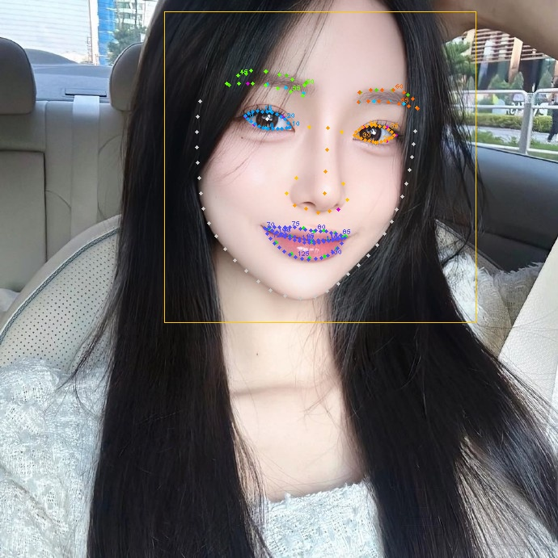

240点人脸关键点 Demo

V014D1A07 模型实际拥有 4 个输出张量:
  "landmark" : [1, 212, 1, 1]  → 106 基础点 × (x,y)
  "out134"   : [1, 268, 1, 1]  → 134 扩展点 × (x,y)
  "out40"    : [1,  80, 1, 1]  →  40 虹膜点 × (x,y)
  "score"    : [1,   1]        → 置信度

240点 = 106基础点 + 134扩展点
  extend_point[0..21]   = 左眼 22pts
  extend_point[22..43]  = 右眼 22pts
  extend_point[44..56]  = 左眉毛 13pts
  extend_point[57..69]  = 右眉毛 13pts
  extend_point[70..133] = 嘴唇 64pts (上唇/下唇/嘴角)

重排序映射已在 build_240_points() 中完整复现。

运行:
  source venv_mnn/bin/activate
  python3 demo_240pts.py [--image 1.jpg]

## The result:

